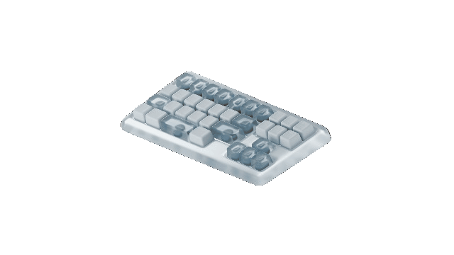

# 🚀 TFT - Ten Fingers Titans

> **A modern, minimal, and beautiful typing speed test app. Inspired by Monkeytype.**

---

<p align="center">
  
</p>

<p align="center">
  
</p>

---

## ✨ Features at a Glance

| 🚀 Feature                | 💡 Description                                      |
|--------------------------|-----------------------------------------------------|
| 🎯 Live WPM & Accuracy   | Real-time stats as you type                         |
| 🖋️ Monkeytype UI         | Clean, word-by-word highlighting                    |
| 🎨 Responsive Design     | Looks great on any device                           |
| 🔄 Quick Reset           | New challenge with every click                      |
| 🖱️ Clickable Logo        | Reload the app instantly                            |
| 🎥 Animated Keyboard GIF | With tooltip on hover                               |
| ♿ Accessibility          | Keyboard-friendly, screen reader support            |

---

## 🌐 [Live Demo](http://localhost:3000) &nbsp; <sup>(or run locally!)</sup>

---

## 🛠️ Getting Started

**Requirements:**
- [Node.js](https://nodejs.org/) (v14 or higher)
- [npm](https://www.npmjs.com/)

**Setup:**
```sh
git clone https://github.com/sivamurthy30/TFT.git
cd TFT/tft
npm install
npm start
```
Then open [http://localhost:3000](http://localhost:3000) in your browser.

---

## 💡 Usage Tips
- **Start typing** the displayed text — your stats update live!
- **Press Reset** for a new random text.
- **Click the logo** (top left) to reload the app.
- **Hover the animated keyboard GIF** (top right) for a fun tooltip.
- **Mobile-friendly:** Try it on your phone or tablet!

---

## 📁 Project Structure

```
tft/
  src/
    App.js
    Main.jsx
    TypingTest.jsx
    TypingTest.css
    App.css
    index.js
    index.css
  public/
    text-box.png
    0-Keyboard-Computer-3840x2160-unscreen.gif
    ...
```

---

## 🙏 Credits & Inspiration
- Inspired by [Monkeytype](https://monkeytype.com/)
- Logo and GIF assets: [Your sources or credits here]

---

## 🤝 Contributing

Pull requests are welcome! For major changes, please open an issue first to discuss what you would like to change.

---

## 📄 License
[MIT](LICENSE)
